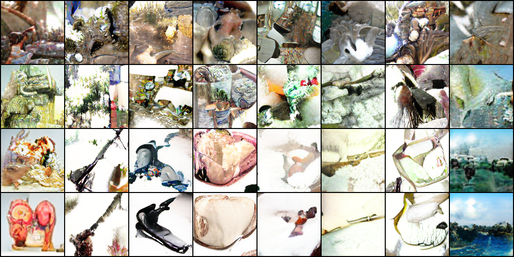
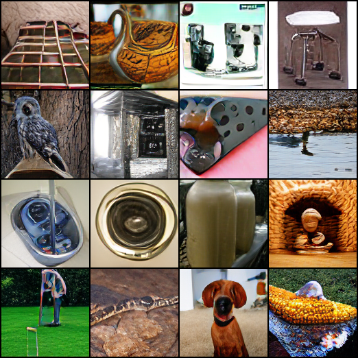

Mini MaskGIT
============

Unofficial implementation of [MaskGIT](https://arxiv.org/abs/2202.04200) in PyTorch and PyTorch Lightning.

## Samples 

Generated with a model trained for 100 epochs on ImageNet tokenized with a VQGAN (f=16, 1024 codebook size) from [taming-transformers](https://github.com/CompVis/taming-transformers). Images have been downscaled to 128x128 pixels for faster training.



Example reconstructions of the original data for comparison:



## Training

**Install dependencies**

```bash
poetry install
````

**Tokenize dataset**

Download VQGAN checkpoint from [https://github.com/CompVis/taming-transformers](https://github.com/CompVis/taming-transformers) to `models/<model_name>/`.

Encode dataset:

```bash
 poetry run python extract_latents.py \
    --config_path=models/<model-name>/config.yaml \
    --ckpt_path=models/<model-name>/model.ckpt \
    --data_root=<path-to-images> \
    --save_path=<codes-path>
```

`<path-to-images>` has to contain a `train`, `val` and `test` folder.

**Run training:**

```bash
poetry run python train.py fit \
    --config=config/config.yaml \
    --config=config/data/<data-config>.yaml \
    --config=config/models/transformer/base.yaml \
    --data.root=<codes-path> \
    --trainer.accelerator=gpu --trainer.devices=1 --trainer.precision=16
```

Logging to [W&B](https://wandb.ai/) can be enabled by adding the following line to the training command:

```bash
--config=config/loggers/wandb.yaml
```

## Todo

- [ ] Improve sampling
- [ ] Large scale training

## References

Chang, Huiwen, Han Zhang, Lu Jiang, Ce Liu, and William T. Freeman. “MaskGIT: Masked Generative Image Transformer.” arXiv, February 8, 2022. https://doi.org/10.48550/arXiv.2202.04200.
